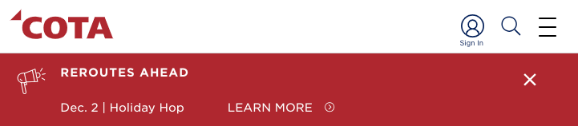

# Central Ohio Transit Authority Reroute PDF Feeds

**> [Add this link to your feedreader](https://raw.githubusercontent.com/benlk/cota-reroute-pdf-rss/main/rss.xml) <**

**> [View historical alerts](./alerts-log.csv) <**

## What

An RSS feed of whenever COTA posts a new alert box in the header of [COTA.com](https://cota.com/). This is most-often used for notice of reroutes.

This feed updates once per day. If you need more-timely updates than that, I'm sorry.

This feed contains the following information, using [the screenshoted alert](https://web.archive.org/web/20231202002042/https://www.cota.com/) as an example:

- The alert's header — `REROUTES AHEAD`
- The alert's description — `Dec. 2 | Holiday Hop`
- The link title — `LEARN MORE`
- The link url — `https://www.cota.com/reroutes/cota-reroutes-holiday-hop-231202.pdf`
- The date of the scrape that generated this alert

This feed does not contain:

- Any information only found at the link
- Any information parsed from the reroute PDF, such as:
    - which lines are affected
    - where the reroute is located
    - where you can catch your bus
- Any information not contained in the alert box

If you want additional information on items in this feed, you'll need to click the link and/or contact COTA.

## Why

When COTA posts a reroute PDF to COTA.com, they don't always announce it. When they do announce it, they only announce it on [enshittified](https://en.wikipedia.org/wiki/Enshittification) privately-owned social media networks: [Twitter](https://twitter.com/COTABus), [Facebook](https://www.facebook.com/cotabus/), [Instagram](https://www.instagram.com/cotabus/). If you don't have logins for those accounts, either you use a proxy like [Nitter](https://nitter.net/COTABus) or you're locked out.

COTA also sometimes posts a notice [via their GTFS feed](https://cota.com/data/) about the reroute, but historically speaking, their GTFS alerts only say that there will be a reroute affecting a route. Their alerts do not, generally speaking, say the location of the reroute.

I don't want to manually check the COTA website every day; I want to receive notifications in the tools that I habitually use. So I wrote this scraper to make an RSS feed.

## Common issues

GitHub serves the RSS feed with the incorrect [`Content-Type` header](https://developer.mozilla.org/en-US/docs/Web/HTTP/Headers/Content-Type) of `text/html`. If this causes problems for your feedreader, consult your feedreader's documentation. FreshRSS supports adding a `#force_feed` to the end of the feed URL to force the software to interpret the file as `application/rss+xml`.

## How & Credits

This project scrapes and archives the contents of the "Alerts" box which is intermittently present in the header of COTA.com. [COTA.com is a Gatsby app](https://whatcms.org/?s=cota.com), and that header is baked in directly. While examining the site's source code one day, I discovered a reference to the WordPress site which powers the Gatsby app. From there, I examined the read-only side of its WP-JSON API, and discovered that the "Alerts" box appears to be powered by the Advanced Custom Fields plugin for WordPress. So rather than scraping the COTA.com Gatsby app directly, I check the ACF endpoint to see if there's a new Alert posted.

https://github.com/benlk/cota-reroute-pdf-rss/blob/11a931909553c71107970c0f0490ff7a64b9f323/scraper.bash#L3

The alert gets saved as JSON to a temporary `build/` directory. I then use [a PHP script](https://github.com/benlk/cota-reroute-pdf-rss/blob/main/parser.php) to parse the JSON file and add any _new_ alerts to [a CSV file](https://github.com/benlk/cota-reroute-pdf-rss/blob/main/alerts-log.csv) listing all historical alerts. 

https://github.com/benlk/cota-reroute-pdf-rss/blob/11a931909553c71107970c0f0490ff7a64b9f323/parser.php#L79-L89

Then with [a different PHP script](https://github.com/benlk/cota-reroute-pdf-rss/blob/main/rss.php) I convert that CSV to the RSS feed.

If the current alert's PDF URL isn't already in the CSV, the new line in the CSV results in a change to the RSS feed, and those changes result in a committable diff in Git. The GitHub Action which runs this scraper then commits the change to the main branch, which results in the updated RSS file becoming available at https://raw.githubusercontent.com/benlk/cota-reroute-pdf-rss/main/rss.xml

https://github.com/benlk/cota-reroute-pdf-rss/blob/11a931909553c71107970c0f0490ff7a64b9f323/.github/workflows/parse-and-generate.yml#L37-L44

This project uses [GitHub Actions](https://docs.github.com/en/actions) [à la Simon Willison](https://simonwillison.net/2021/Mar/5/git-scraping/) to perform the scrape,. The process of writing this was greatly aided by [Lasse Benninga's blog post on GitHub Actions scrapers](https://medium.com/@lassebenninga/setup-free-webscraping-in-less-than-5-minutes-using-github-actions-330e1151fbea), which simplifies and expands on Simon Willison's model.
